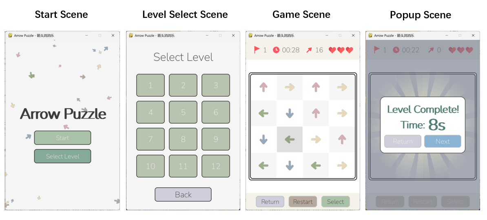

# Arrow Puzzle —（箭头消消乐）

一个基于 Python + Pygame 开发的益智消除小游戏。

## 项目名称

Arrow Puzzle（箭头消消乐）

## 游戏简介

「箭头消消乐」是一款规则简单、易于上手的箭头消除益智游戏：

- 棋盘上分布着上、下、左、右四种方向的箭头；
- 鼠标点击一个箭头，它会沿自身指向飞出棋盘；
- 若前进路径上没有其他箭头阻挡，则成功飞出并消除；
- 若路径被其他箭头阻挡，则触发碰撞反馈并扣除一次失误；
- 在限时内清空棋盘所有箭头即可通关，失误次数耗尽或超时则失败。

游戏内置 **12 个**由易到难的关卡（棋盘从 4×4 逐步增大到 12×12），
支持关卡选择、重新开始、通关后自动进入下一关，以及全部通关后的结算界面。

## 开发环境

- 操作系统：Windows / macOS / Linux（跨平台）
- Python 3.10+
- Pygame 2.6.1
- packaging 26.3

## 安装和运行方法

```bash
# 1. 创建并激活虚拟环境
conda create -n arrow_env python=3.10
conda activate arrow_env

# 2. 安装依赖
pip install -r requirements.txt

# 3. 运行游戏
python src/main.py
```

## 游戏操作说明

| 操作 | 说明 |
|---|---|
| 鼠标点击箭头 | 点击一个箭头使其沿指向飞出；无阻挡则消除，有阻挡则扣一次失误 |
| 顶部状态栏 | 依次显示当前关卡、剩余时间、剩余箭头数与剩余生命（爱心） |
| Return | 返回开始界面 |
| Restart | 重新开始当前关卡 |
| Select | 进入关卡选择界面 |

- **通关**：清空当前关卡全部箭头后弹出通关弹窗，可「Return」返回开始或「Next」进入下一关；
- **失败**：失误次数耗尽或倒计时归零后弹出失败弹窗，可「Return」返回开始或「Retry」重试本关；
- **全部通关**：通过最后一关后弹出结算弹窗。

## 游戏截图



## 附加：关卡生成与自动化测试

### 关卡生成器（`src/level_generator.py`）

独立的关卡生成模块（不依赖 pygame），通过「逆序构造 + 回溯搜索」保证生成的关卡一定可通关，
并支持 easy（简单）/ normal（普通）/ hard（困难）三档难度。

#### 命令行用法

```bash
python src/level_generator.py [rows] [max_mistakes] [time_limit] [选项]
```

| 参数 | 说明 | 默认值 |
|---|---|---|
| `rows` | 棋盘行数（生成正方形棋盘） | 6 |
| `max_mistakes` | 最大失误次数 | 3 |
| `time_limit` | 时间限制（秒） | 45 |
| `--level` | 关卡编号；追加到 `levels.json` 时设为「当前最大编号 + 1」 | 1 |
| `--cols` | 棋盘列数（默认等于行数，可生成矩形棋盘） | 同 `rows` |
| `--seed` | 随机种子（固定后每次生成相同关卡） | 随机 |
| `--difficulty` | 难度：`easy` / `normal` / `hard` | `easy` |
| `--metrics` | 在 stderr 打印难度指标（依赖链 / 平均深度 / 开局即消 / 同向比） | 关闭 |

```bash
# 生成 8×8、3 次失误、60 秒的普通关卡，编号 13，固定种子以便复现
python src/level_generator.py 8 3 60 --level 13 --difficulty normal --seed 42

# 生成 6×9 矩形、困难难度的关卡，并打印难度指标
python src/level_generator.py 6 3 45 --cols 9 --difficulty hard --metrics
```

运行后 stdout 输出一段 JSON，直接粘贴进 `data/levels.json` 的 `"levels"` 数组即可。

#### Python 调用

```python
from level_generator import generate_level, generate_level_json, find_solution

# 返回与 data/levels.json 相同结构的 dict
level = generate_level(rows=8, max_mistakes=3, time_limit=60,
                       difficulty="normal", seed=42)

# 直接得到可粘贴进 levels.json 的 JSON 字符串
json_str = generate_level_json(8, 3, 60, difficulty="hard", level=13)

# 求一个 0 失误的通关顺序（用于校验可解性）
solution = find_solution(level["map"])
```

### 自动化测试

`tests/test_level_generator.py` 用一套独立的判定逻辑交叉验证生成关卡的可解性：

```bash
python tests/test_level_generator.py
# 或
python -m unittest discover -s tests -v
```
